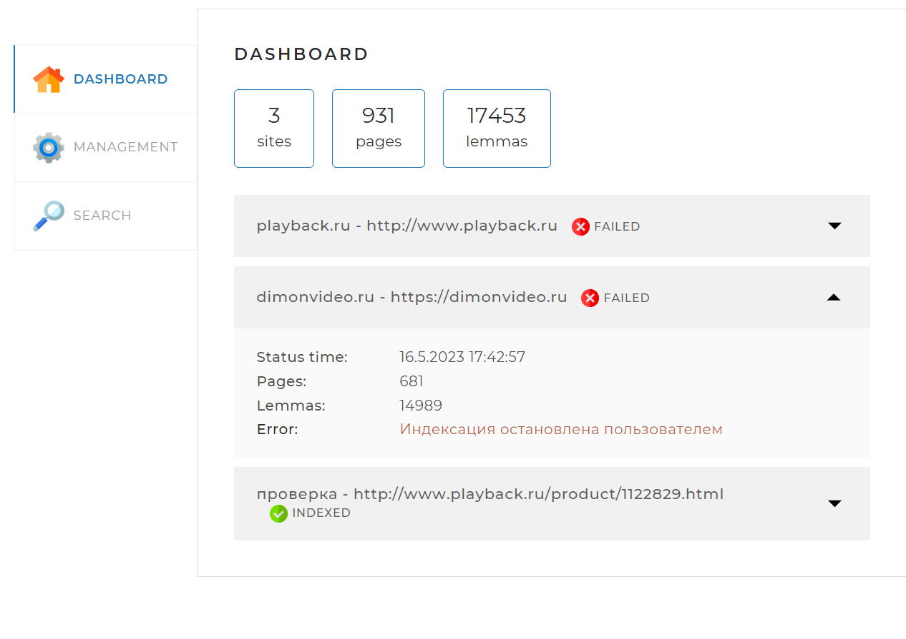
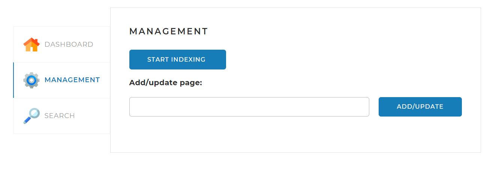
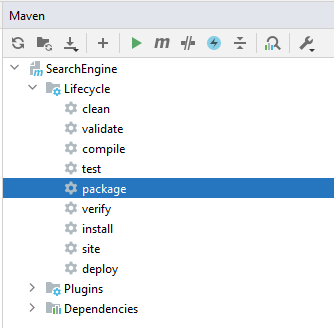

# SearchEngine
Данный проект реализует поисковый движок, предоставляющий пользователю специальный
API со следующими основными функциями: 
<li>предварительное индексирование сайтов;</li>
<li>идексация / переиндексация отдельной страницы сайта;</li>
<li>выдача основных сведений по сайтам;</li>
<li>поиск ключевых слов в проиндексированных сайтах и предоставление их пользователю.</li>

## Веб-страница

В проект также входит веб-страница, которая позволяет управлять процессами, реализованными
в движке.

Страница содержит три вкладки.

### Вкладка DASHBOARD

Эта вкладка открывается по умолчанию. На ней
отображается общая статистика по всем проиндексированным сайтам, а также
детальная статистика и статус по каждому из сайтов (статистика,
получаемая по GET-запросу <i>/statistics</i>).

### Вкладка MANAGEMENT

На этой вкладке находятся инструменты управления 
поисковым движком — запуск (GET-запрос <i>/startIndexing</i>) 
и остановка (GET-запрос <i>/stopIndexing</i>) полной индексации
(переиндексации), а также возможность добавить (обновить)
отдельную страницу по ссылке (POST-запрос <i>/indexPage/{pagePath}</i>).

### Вкладка SEARCH

Эта вкладка предназначена для тестирования поискового
движка. На ней находится поле поиска и выпадающий список с
выбором сайта, по которому искать, а при нажатии на кнопку
<i>SEARCH</i> выводятся результаты поиска (по GET-запросу /search).

## Файлы настройки
В конфигурационном файле <i>application.yaml</i>,
который находится в корне проекта, указываются основные параметры работы программы.

### Раздел server

В этом разделе задаётся параметр <i>port</i> — порт, через который контроллеры 
приложения "слушают" веб-запросы. Задавая разные порты, можно, например, 
из разных папок, в которых находятся файлы настройки, запустить несколько 
экземпляров приложения.

### Раздел spring

Здесь задаются параметры СУБД, в которой приложение хранит 
данные конфигурации.

В параметрах <i>spring.datasource.username</i> и <i>spring.datasource.password</i> указываются логин и пароль для подключения к СУБД MySQL.
База данных создаётся на основе классов из пакета <i>main.model</i>. В том случае, когда параметр <i>spring.jpa.hibernate.ddl-auto</i> установлен <i>create</i>, база данных пересоздается (стераются все данные в схеме <i>search_engine</i>) при каждом новом запуске приложения.
Если парметр <i>spring.jpa.hibernate.ddl-auto</i> установлен <i>update</i>, то база данных обновляется, но не создается заново.

### Раздел indexing-settings
В парамертах <i>indexing-settings.userAgent</i> и <i>indexing-settings.referrer</i> указывается информация, чтобы сервера с индексируемыми сайтами вопринимали программу, как обычного посетителя.

#### Список <i>sites</i>
Здесь приведён список сайтов, которые программа будет
индексировать. Каждый сайт характеризуется
следующими параметрами:
<li>
<i>url</i> — адрес сайта (обязательно без знака "<b>/</b>" в конце).;
</li>
<li>
<i>name</i> — имя сайта. Оно, в частности, выводится в списке сайтов
на вкладке DASHBOARD;
</li>

## Используемые технологии
Приложение построено на платформе <i>Spring Boot</i>.

Необходимые компоненты собираются с помощью фреймворка Maven.
Maven подключает следующие относящиеся к <i>Spring Boot</i> стартеры:
<li>
<i>spring-boot-starter-web</i> — подтягивает в проект библиотеки, 
необходимые для выполнения Spring-MVC функций приложения;
</li>
<li>
<i>spring-boot-starter-data-jpa</i> — отвечает за подключение библиотек,
требующихся для работы приложения с базой данных;
</li>
<li>
<i>spring-boot-starter-thymeleaf</i> — шаблонизатор веб-страницы программы.
</li>

Для загрузки и разбора страниц с сайтов используется библиотека <i>jsoup</i>.

Данная версия программы работает с СУБД MySQL. Для этого 
подключается зависимость <i>mysql-connector-java</i>.

Для удобства написания (и чтения) программного кода и для
расширения функциональности языка Java используется библиотека
Lombok (зависимость <i>lombok</i>).

## Запуск программы

Если проект загрузить на локальный диск, то он готов к тому,
чтобы его можно было скомпилировать и запустить с помощью среды
разработки IntelliJ IDEA.

Перед первой компиляцией программы следует выполнить следующие шаги:
<ol>
<li>
Установить СУБД — одну или несколько, если они ещё не установлены.
</li>
<li>
В базе данных создать схему <i>search_engine</i>. Имя схемы может быть и
другим, но тогда это должно быть отражено в параметре
<i>spring.datasource.url</i> в файле <i>application.yaml</i>.
</li>
<li>
В схеме нужно создать пользователя <i>username</i> с паролем 
<i>password</i>. Пользователь и пароль могут быть другими, это опять
же должно соответствовать параметрам <i>spring.datasource.username</i> и 
<i>spring.datasource.password</i> в файле <i>application.yaml</i>.
</li>
<li>
Установить параметр <i>jpa.hibernate.ddl-auto</i> так, как это описано выше.
</li>
<li>
Установить фреймворк Apache Maven, если он ещё не установлен.
</li>
<li>

Приложение может быть также запущено командной строкой. Для этого 
оно должно быть скомпилировано в панели <i>Maven</i> среды разработки  
командой <i>package</i>:

Результат компиляции, <i>SearchEngine-1.0-SNAPSHOT.jar</i>, 
будет располагаться в папке <i>target</i>. Этот файл можно перенести
в любую доступную папку на компьютере, при этом в той же папке 
должн находиться файл <i>application.yaml</i>. 
Приложение запускается строкой

`java -jar SearchEngine-1.0-SNAPSHOT.jar`.

## Особенности работы программы
При остановке индексации программа перестает отправлять на выполнение
новые задачи по индексации страниц сайта, однако программа позволяет завершить все уже запущенные 
задачи индексации. Во время, когда уже запущенные задачи "добегают", нажатия на кнопки <b>START INDEXING</b> и
<b>STOP INDEXING</b> приводят к выводу сообщений <i>"Индексация уже запущена"</i> и
<i>"Индексация не запущена"</i> соответственно. Через некоторое время, когда все уже запущенные задачи индексации "добегут",
программа снова позволит запустить индексацию/переиндексацию сайтов.